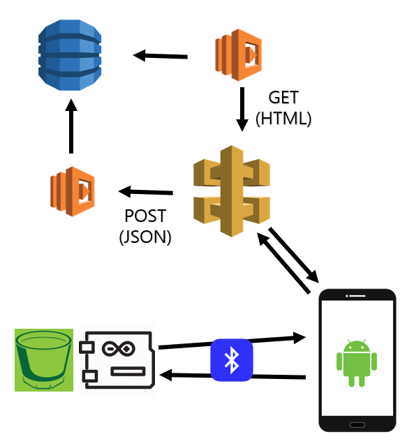
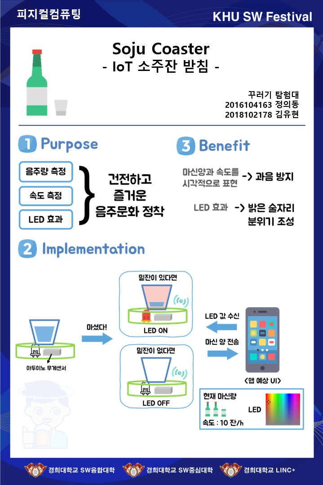
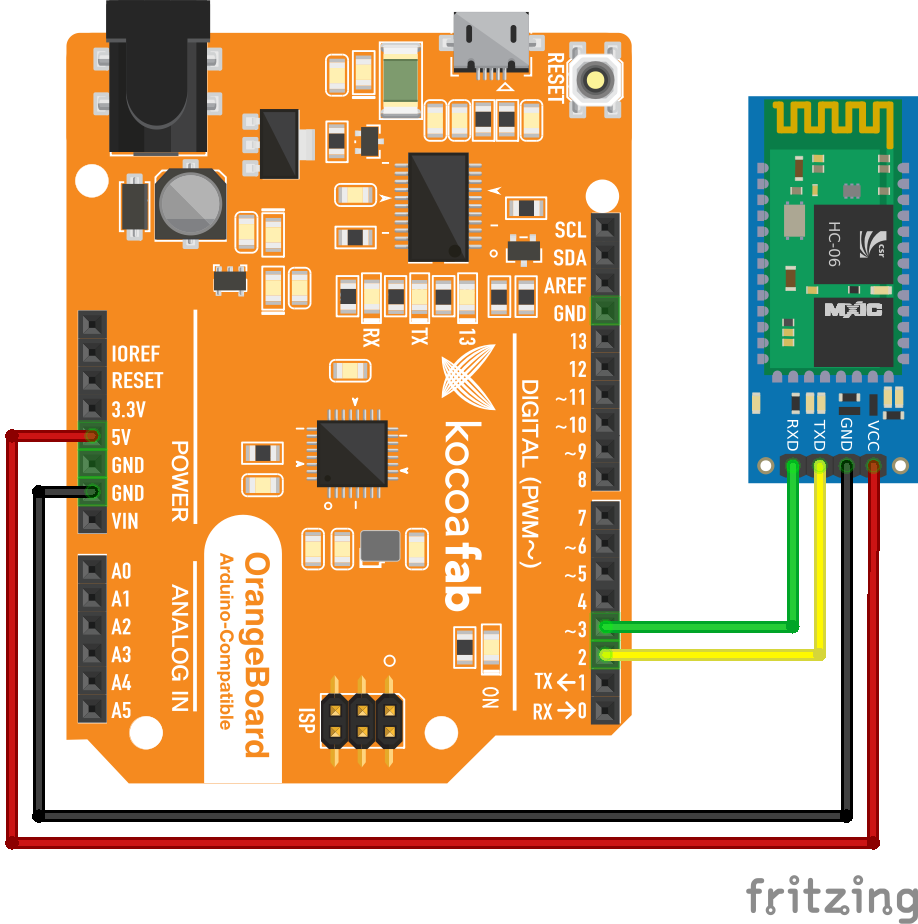
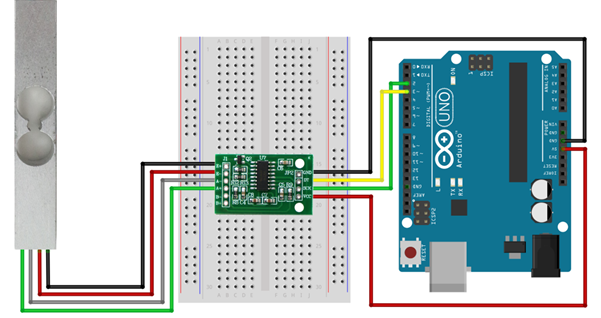
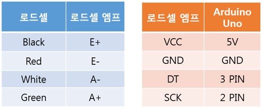
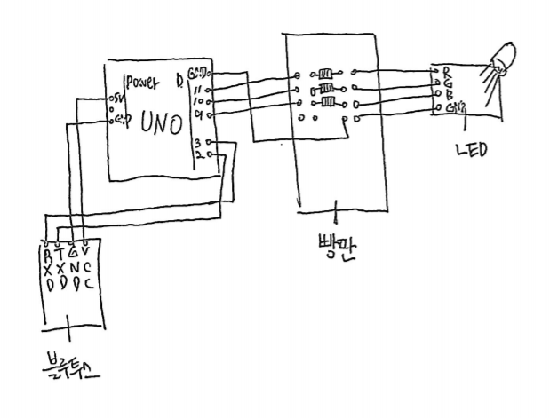

# 소주 밑잔 찾기 프로젝트

### Overall
- If you want see just code, go to final folder.
  - SojuCoaster is a android app code.
  - Soju_Coaster is a arduino app code.
  - and added lambda code.
    - if you want a GET implementation must handle API GATE Way's mapping

  

### Poster
  

### Goal
##### 1. 블루투스 모듈 연결해보기
- [x] bluetooth 모듈 연결하기

[android bluetooth app](https://hyoin1223.tistory.com/entry/%EC%95%88%EB%93%9C%EB%A1%9C%EC%9D%B4%EB%93%9C-%EB%B8%94%EB%A3%A8%ED%88%AC%EC%8A%A4-%ED%94%84%EB%A1%9C%EA%B7%B8%EB%9E%98%EB%B0%8D)

- [x] 다른 사람이 만들어 놓은 앱을 이용해서 테스트

##### 2. 무게 센서 납땜하고 연결해보기
- [x] 납땜하기

- [x] 센서 코드 작성

##### 3. 무게 센서의 정밀 측정하기.
- [x] 소주잔 직접 올려보기

##### 4. 블루투스로 정밀하게 측정한 값을 전송하기
- [x] 개발 장치 정하기 : android application
- [x] 아두이노에서 의미있는 데이터만 전송하도록 설정.
- [x] android app에서 LED data를 전송할 수 있도록 설정.

##### (5. 밑잔이 있을 경우 불빛을 밝혀주는 구조로 나타내기)
- [x] 아두이노 코드에 잔을 들었는지, 놓았는지 판단하는 기능 추가.
- [x] 아두이노 코드에 밑잔 check 기능 추가.

##### 6. 아두이노 블루투스를 이용한 안드로이드로 RGB led 제어하기
- [x] BLUETOOTH 통신 SETTING

##### 7. Android application 개발
- [x] ui setting
 - [x] 마신량
 - [x] 마신량 / h
 - [x] 마지막으로 마신 시간으로 부터 흐른 시간
 - [x] ranking 도전 button
 - [x] ranking view button
 - [x] LED Setting seek bar & button
- [x] logic implementation
 - [x] bluetooth networking(connection & setting & send & receive)
 - [x] 시간 단위로 UI 변환
 - [x] http request (GET / POST)
 - [x] Asynchroized work (시간 단위 UI 변환 & UI control & http network & bluetooth network)

##### 8. Ranking Site 구현
- AWS lambda, API Gateway와 DynamoDB 이용
- [x] DynamoDB table 생성.
- [x] Lambda python logic 설계.
- [x] API Gateway를 이용한 api open.
  - [x] GET -> text/html
  - [x] POST -> application/json

##### 9. 3D printing을 통한 외형 제작
- 경희대학교 OPEN LAB실을 이용.
- modeling (CED) = Solidworks.
- [x] Test & Final
- [x] Design

### 실습 파일

##### lab01. serial 통신으로 문자전송(lab01)

##### lab02. 무게 센서 코드(lab02)

##### lab03. 블루투스로 led 제어(lab03)
***
### 출처
[아두이노 블루투스 관련 포스트](https://hyoin1223.tistory.com/entry/%EC%95%88%EB%93%9C%EB%A1%9C%EC%9D%B4%EB%93%9C-%EB%B8%94%EB%A3%A8%ED%88%AC%EC%8A%A4-%ED%94%84%EB%A1%9C%EA%B7%B8%EB%9E%98%EB%B0%8D)

[아두이노 무게센서(로드셀) 관련 포스트](https://blog.naver.com/PostView.nhn?blogId=eduino&logNo=221078931222)

[아두이노 블루투스 관련 포스트](https://www.hackster.io/kamatalaashish/control-rgb-led-using-bluetooth-7832af)
